# Jira Clone

Project management and issue tracking system built with GritShield, featuring agile board support, workflow automation, and real-time collaboration.

## Overview

This application provides a Jira-like experience for managing software development projects, with support for:

- **Project Management**: Create and manage multiple projects with custom workflows
    
- **Issue Tracking**: Create, assign, and track issues (tasks, bugs, stories)
    
- **Agile Boards**: Kanban boards with sprint support
    
- **Workflow Automation**: Customizable workflow steps with transitions
    
- **User Management**: Role-based access control (Admin, Member, Viewer)
    

## Key Business Features

### Projects

- Create, update, and delete projects
    
- Each project has its own workflow steps
    
- Project-specific boards and backlogs
    
- Member management with role assignments
    

### Issues

- Create issues with types (Bug, Task, Story, Epic)
    
- Assign issues to team members
    
- Track priority (Low, Medium, High)
    
- Add comments to issues
    
- Move issues across workflow steps
    
- Search issues using JQL-like queries
    

### Sprints

- Create sprints with goals and timeframes
    
- Start and manage active sprints
    
- Assign issues to sprints
    
- Sprint burndown tracking
    

### Workflow

- Customizable workflow steps per project
    
- Visual board columns
    
- Step transitions with validation
    
- Workflow management interface
    


# Dependency Injection

Gritshield's **dependency injection** system handles all the dependency wiring — saving dozens of lines of repetitive code.

```mermaid
graph LR
    %% Styles
    classDef transient fill:#112638,stroke:#89dceb,color:#89dceb,stroke-width:1.5px;
    classDef singleton fill:#132a1e,stroke:#a6e3a1,color:#a6e3a1,stroke-width:1.5px;
    classDef handler fill:#1e1e2e,stroke:#f5e0dc,color:#f5e0dc,stroke-width:1px;

    %% Subgraph to align all entry-point handlers together on the left
    subgraph Handlers ["Route Handlers / Entry Points"]
        get_backlog:::handler
        assign_issue_sprint:::handler
        update_member_role:::handler
        list_members:::handler
        remove_member:::handler
        add_member:::handler
        settings_page:::handler
        switch_project:::handler
        create_project_workflow:::handler
        project_selector_partial:::handler
        debug_project:::handler
        backlog_page:::handler
        new_issue_modal:::handler
        search_results:::handler
        workflow_management_page:::handler
        user_management_page:::handler
        board_page:::handler
        issue_detail_modal:::handler
        projects_page:::handler
        project_detail_page:::handler
        move_step:::handler
        create_issue:::handler
        assign_issue:::handler
        get_issue:::handler
        add_comment:::handler
        search_issues:::handler
        move_issue:::handler
        get_board:::handler
        update_project:::handler
        delete_project:::handler
        get_project_issues:::handler
        search_projects:::handler
        create_project:::handler
        get_project:::handler
        list_projects:::handler
        update_workflow_step:::handler
        add_workflow_step:::handler
        delete_workflow_step:::handler
        toggle_workflow_step:::handler
        list_users:::handler
        create_sprint:::handler
        start_sprint:::handler
        handle_login:::handler
    end

    %% Repositories & Services
    CommentRepository["CommentRepository (Transient)"]:::transient
    SprintRepository["SprintRepository (Transient)"]:::transient
    JqlParser["JqlParser (Transient)"]:::transient
    WorkflowRepository["WorkflowRepository (Transient)"]:::transient
    ProjectRepository["ProjectRepository (Transient)"]:::transient
    ProjectService["ProjectService (Transient)"]:::transient
    ProjectMemberRepository["ProjectMemberRepository (Transient)"]:::transient
    BoardService["BoardService (Transient)"]:::transient
    DatabaseConnection[("DatabaseConnection (Singleton)")]:::singleton
    IssueRepository["IssueRepository (Transient)"]:::transient
    IssueService["IssueService (Transient)"]:::transient
    UserRepository["UserRepository (Transient)"]:::transient
    WorkflowEngine["WorkflowEngine (Transient)"]:::transient

    %% Connections
    CommentRepository -->|"requires"| DatabaseConnection
    get_backlog -->|"requires"| BoardService
    assign_issue_sprint -->|"requires"| BoardService
    update_member_role -->|"requires"| ProjectMemberRepository
    list_members -->|"requires"| ProjectMemberRepository
    remove_member -->|"requires"| ProjectMemberRepository
    add_member -->|"requires"| ProjectMemberRepository
    SprintRepository -->|"requires"| DatabaseConnection
    settings_page -->|"requires"| WorkflowRepository
    switch_project -->|"requires"| ProjectService
    create_project_workflow -->|"requires"| ProjectService
    project_selector_partial -->|"requires"| ProjectService
    debug_project -->|"requires"| BoardService
    debug_project -->|"requires"| ProjectService
    settings_page -->|"requires"| ProjectService
    backlog_page -->|"requires"| SprintRepository
    new_issue_modal -->|"requires"| SprintRepository
    search_results -->|"requires"| IssueService
    settings_page -->|"requires"| UserRepository
    new_issue_modal -->|"requires"| ProjectService
    workflow_management_page -->|"requires"| ProjectService
    user_management_page -->|"requires"| UserRepository
    board_page -->|"requires"| BoardService
    workflow_management_page -->|"requires"| WorkflowRepository
    user_management_page -->|"requires"| ProjectMemberRepository
    search_results -->|"requires"| JqlParser
    issue_detail_modal -->|"requires"| IssueService
    projects_page -->|"requires"| ProjectService
    user_management_page -->|"requires"| ProjectService
    board_page -->|"requires"| ProjectService
    backlog_page -->|"requires"| IssueService
    backlog_page -->|"requires"| WorkflowRepository
    project_detail_page -->|"requires"| ProjectService
    WorkflowRepository -->|"requires"| DatabaseConnection
    move_step -->|"requires"| IssueService
    create_issue -->|"requires"| IssueService
    assign_issue -->|"requires"| IssueService
    get_issue -->|"requires"| IssueService
    add_comment -->|"requires"| IssueService
    search_issues -->|"requires"| JqlParser
    search_issues -->|"requires"| IssueService
    move_issue -->|"requires"| BoardService
    get_board -->|"requires"| BoardService
    update_project -->|"requires"| ProjectService
    delete_project -->|"requires"| ProjectService
    get_project_issues -->|"requires"| ProjectService
    search_projects -->|"requires"| ProjectService
    create_project -->|"requires"| ProjectService
    get_project -->|"requires"| ProjectService
    list_projects -->|"requires"| ProjectService
    ProjectRepository -->|"requires"| DatabaseConnection
    ProjectService -->|"requires"| ProjectRepository
    ProjectMemberRepository -->|"requires"| DatabaseConnection
    BoardService -->|"requires"| IssueRepository
    BoardService -->|"requires"| WorkflowEngine
    BoardService -->|"requires"| SprintRepository
    BoardService -->|"requires"| DatabaseConnection
    BoardService -->|"requires"| WorkflowRepository
    update_workflow_step -->|"requires"| WorkflowRepository
    add_workflow_step -->|"requires"| WorkflowRepository
    delete_workflow_step -->|"requires"| WorkflowRepository
    toggle_workflow_step -->|"requires"| WorkflowRepository
    list_users -->|"requires"| UserRepository
    create_sprint -->|"requires"| SprintRepository
    start_sprint -->|"requires"| SprintRepository
    IssueRepository -->|"requires"| DatabaseConnection
    handle_login -->|"requires"| ProjectMemberRepository
    handle_login -->|"requires"| UserRepository
    handle_login -->|"requires"| ProjectRepository
    IssueService -->|"requires"| SprintRepository
    IssueService -->|"requires"| IssueRepository
    IssueService -->|"requires"| CommentRepository
    UserRepository -->|"requires"| DatabaseConnection
```




## Workflow Automation

The project includes an event-driven architecture for business process automation:

### Events

- **IssueCreated**: Triggers when new issues are created
    
- **IssueTransitioned**: Triggers when issues move between workflow steps
    
- **CommentAdded**: Triggers when comments are added to issues
    

### Jobs

- **SendIssueDigestJob**: Background job for email notifications
    
- **GenerateSprintBurndownJob**: Background job for sprint metrics
    

### Event Flow Diagram


## Service Architecture

The application uses dependency injection for clean separation of concerns:

```text

┌──────────────────────────────────────────────────────────────┐
│                    Controllers Layer                         │
│  ┌────────────┬──────────┬──────────┬──────────┬─────────┐   │
│  │   Auth     │  Board   │  Issue   │ Project  │ Sprint  │   │
│  └────────────┴──────────┴──────────┴──────────┴─────────┘   │
└──────────────────────────────────────────────────────────────┘
                              │
                              ▼
┌──────────────────────────────────────────────────────────────┐
│                    Services Layer                            │
│  ┌────────────┬──────────┬──────────┬──────────┬─────────┐   │
│  │ Board      │ Issue    │ Project  │ Workflow │ JQL     │   │
│  └────────────┴──────────┴──────────┴──────────┴─────────┘   │
└──────────────────────────────────────────────────────────────┘
                              │
                              ▼
┌──────────────────────────────────────────────────────────────┐
│                    Repositories Layer                        │
│  ┌────────────┬──────────┬──────────┬──────────┬─────────┐   │
│  │ Project    │ Issue    │ Sprint   │ Workflow │ User    │   │
│  └────────────┴──────────┴──────────┴──────────┴─────────┘   │
└──────────────────────────────────────────────────────────────┘
```

## Technology Stack

- **Framework**: Gritshield (custom Rust web framework)
    
- **Database**: SeaORM with PostgreSQL
    
- **Frontend**: HTMX for dynamic updates, Maud for HTML templates
    
- **Events**: Event bus for decoupled communication
    
- **Jobs**: Background job processing
    
- **Security**: Role-based access control, input sanitization
    

## Getting Started

### Installation

1. Clone the repository
    
2. Set up database configuration
    
3. Run database migrations
    
4. Start the application
    
5. Access the web interface at `http://localhost:8080`
    

### Default Login

- Email: admin@example.com
    
- Password: admin123

- Admin Panel: check .env file
